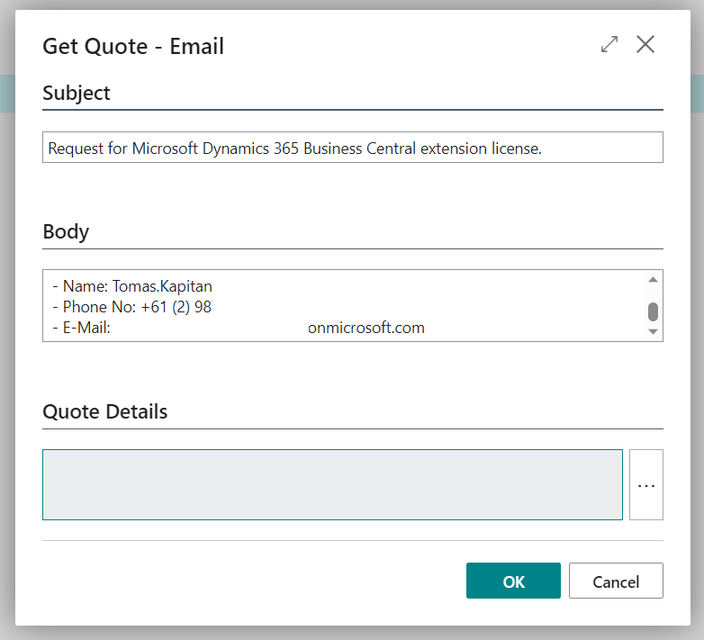
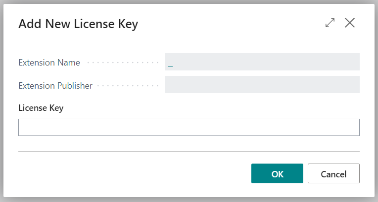
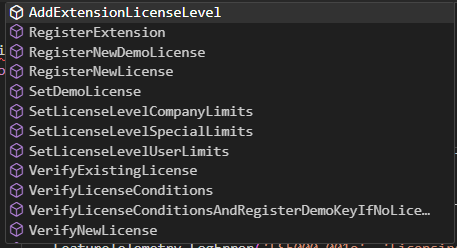

# Functionality

There are two main pages in this extension, **Licensable Extensions** and **Existing Licenses**.

### Licensable Fusion5 Extensions

- This page contains **all installed extensions** that support licensing using our extension. Extensions are added to this list when they are installed.
- For all installed extensions that support this licensing module, users can see information
  - **Licensed Permanently**: If the extension is licensed permanently, there are no conditions for the extension usage and the extension is never verified against the remote licensing server. This field is used for installations where the extension was bought in a non-subscription way.
  - **Parent Extension Name**: Some of the extensions could be licensed as a complex solution. In that case, the child extension shared the licensing conditions and requirements of the parent extension.
  - **Requires License for Sandbox**: By default, extensions do not require any license for the Sandbox environment. If the extension uses the licenses even for the Sandbox environment, this field is set to Yes.
- From this page, users can open the following pages
  - **License Levels**: Each extension could have multiple licensing levels, for example, for a different number of users, companies or with custom conditions. Levels are defined by the licensed extension.
  - **Existing Licenses**: Overview of all existing licenses in the system for the selected extension.
  - **Documentation** and **Support** are external links; URL addresses are defined by licensed extensions.
- Users could also request a quote for selected extensions/extension levels using the action **Get a Quote**. The body is predefined automatically with all important details and can be edited by the users. Before the email can be sent, users have to select the extension level(s) that they are interested in.

### Existing Fusion5 Licenses

- Existing licenses show the list of all existing and applied licenses. 

- From this page, users can also add a new license key using the action **Add New License Key**. 
- Users can also **Refresh License** to update the local license details, for example when the license key is upgraded to higher license level.
- The license keys, as well as all other license tables, are shared across all environment companies. This means that if the license allows only a specified number of companies, the client must manage the total number of existing companies and remove the companies that are over this limit or extend the license limits.

### User Limits

If the extension limits number of the users that may use the extension, only users with plans different from the plans below are considered.
- Global Admin
- D365 Admin
- D365 Admin Partner
- Delegated Admin
- Helpdesk
- Accountant Hub
- Microsoft 365

## For developers

To add this extension to a new add-on, use the **codeunit 71697595 "FS5 Licensing Management"**.

### Codeunit 71697595 "FS5 Licensing Management"

- There are a lot of procedures (and overloaded procedures) that allow configuring everything directly from this extension.
- To add a new extension, do
  1) **RegisterExtension()**
     - Only allowed publishers are able to register extensions.
     - Publishers must be listed in this extension; the same publisher (Fusion5) as the publisher of the licensing module is always allowed.
  1) **AddExtensionLicenseLevel()** for all levels extension needs
  1) **SetRequireLicenseForSandbox()** if the extension must be licensed even for the Sandbox environments. 
     - By default, extensions do not need to be licensed for Sandbox environments.
  1) **SetLicenseLevelCompany()** or User limits for all created levels
  1) **SetLicenseLevelSpecialLimits()**
     - To define your licensing conditions, extend the **Enum 71697590 "FS5 Special License Cond."** and implement the interface **"FS5 ISpecial License Cond."**
  1) **AddPermanentLicense()**
  1) **AddChildExtensionCreateBundle()**

  Optionally, use **RegisterNewDemoLicense()** if you want to use the demo license key. Otherwise, the extension can't be used in the production environment and can be used without any conditions/limits in every Sandbox environment.

### External Publishers

This extension allows other companies to license their solutions. To be able to use the extension, they must be listed **CheckPublisher()** procedure; otherwise, they are not allowed to register an extension.

External publisher must
1) Be allowed by us to register an extension (see previous part)
1) Extend the "**FS5 Verification Service**" enum and implement the associated interface "**FS5 Verification Service**"
  - The procedure must return a record in temporary **table 71697596 "FS5 Remote License"** with information about the license. If the license is not valid, the procedure must return false or raise a custom error.
2) Subscribe to **OnRegisterVerificationServices()** in **Codeunit 71697599 "FS5 Verification Service Mgt."**
3) Call the **RegisterVerificationService()** procedure in **Codeunit 71697599 "FS5 Verification Service Mgt."** from the subscribe