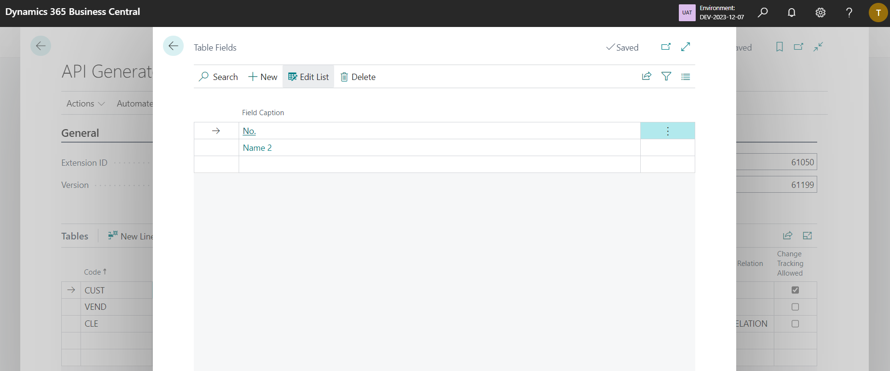
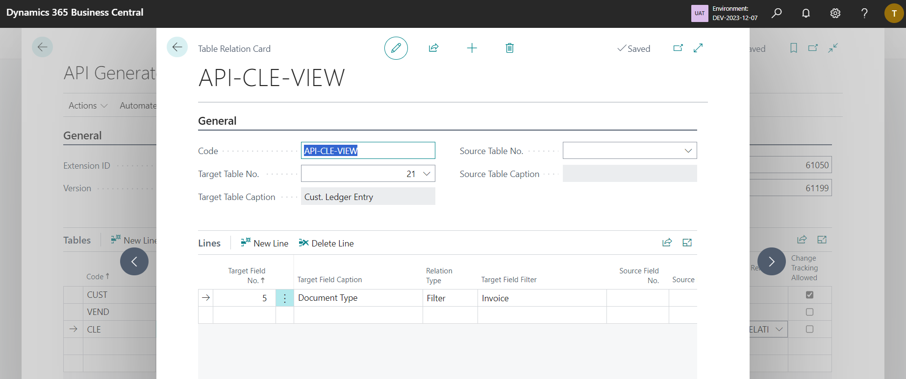

# Functionality

## API Generator

The main page can be found through the search as **API Generator**. 

The fields in the header section should not be changed, except if there is a reason for this change and the user knows the consequences.

### Tables

This section allows you to define all API pages. Every API page is based on the source table from which the fields contained in it come. 

- **Code**
  - Unique identifier of the API page. This value is not used in generated API page and is used only for API definition.
- **Table Caption**
  - Specifies the table on which the API page is based on.
- **Table View**
  - This is optional field to specify the SourceTableView property. Using this property users can limit data visible in the API page.
- **API Version**
  - This field is not used now.
- **Page Object ID**
  - Automatically assigned page object ID.
  - This field should not be changed, except if there is a reason for this change and user knows the consequences.
- **Page Object Name**
  - Automatically assigned page name.
  - This field should not be changed, except if there is a reason for this change and user knows the consequences.
- **Parent Table Code**
  - Optional field to specify parent-child relation. If specified, the child API page is exposed separately, but also as a part of the parent object.
  - The **Parent Table Relation** is mandatory when this field has a value.
- **Parent Table Relation**
  - Specifies connection between parent and child table.
- **Change Tracking Allowed**
  - Sets a value that indicates whether the entity exposed through the OData API supports change tracking.

### Table Fields

Every API Page must have at least one field. To define a field, select the table, choose the action **Fields** and choose all fields that should be included on the API page.

### Source Table View

A table view can limit the number of records included in the API page. To create a table view, create a new relation, set **Target Table No.** to the same table as your API page, and leave the **Source Table No.** blank.

Specify any condition in the line section (all lines automatically have an AND condition). Only **Type** = **Filter** is allowed for table view.

### Parent-Child Relations

Parent-child relations can be used to include one API page in another API page (for example, to access customer ledger entries through the customer API page). 

To create a relation, create a new relation, set **Target Table No.** to the same table as your API page and the **Source Table No.** to the table of the parent API page.

Specify any condition in the line section (all lines have AND condition automatically). Both **Types** = **Filter** and **Field** are allowed.

